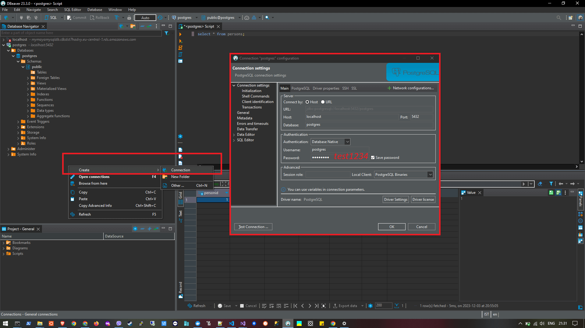
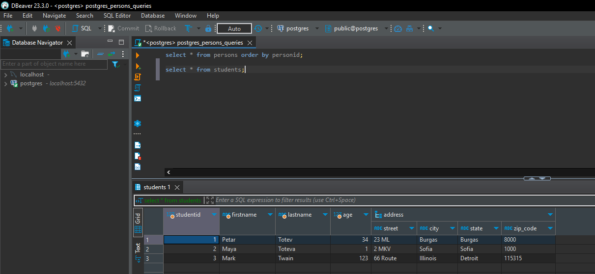

# PT_Demo_PostgreSQL
PT_Demo_PostgreSQL is a simple .NET 8 Console Application to test connectivity with PostgreSQL database using Npgsql.

## Contents

- [Initial Setup](#initial-setup)
- [Codebase](#codebase)
    - [Demo Persons](#demo-persons) - create simple table
    - [Demo Employees](#demo-employees) - create table that stores objects as `JSONB`
    - [Demo Students](#demo-students) - create table using `TYPE` that stores objects having a complex property (Address)
- [MySQL vs PostgreSQL Comparison](#mysql-vs-postgresql-comparison)
- [Links](#links)

## Initial Setup

1. Execute the following Docker command in cmd.exe in order to pull the latest `postgres` image:

```
docker pull postgres:latest
```

2. Next, run the following Docker command in cmd.exe in order to run the pulled `postgres` image in a container named `postgrescntr` on port 5432:

```
docker run --name postgrescntr -e POSTGRES_PASSWORD=test1234 -p 5432:5432 -d postgres
```

3. Connect to the database using [DBeaver](https://dbeaver.io/download/) or [pgAdmin](https://www.pgadmin.org/download/):



## Codebase

In order to connect to the `postgres` database, you need to install the latest [Npgsql NuGet package](https://www.nuget.org/packages/Npgsql/).

### Demo Persons

```
CREATE TABLE Persons(
PersonID SERIAL PRIMARY KEY NOT NULL,
FirstName varchar(255),
LastName varchar(255),
Gender varchar(1),
Address varchar(255),
City varchar(255));
```

### Demo Employees

```
CREATE TABLE Employees (
EmployeeId SERIAL PRIMARY KEY,
EmployeeData JSONB);
```

### Demo Students

```
CREATE TYPE Address AS (
street VARCHAR,
city VARCHAR,
state VARCHAR,
zip_code VARCHAR);
```

```
 CREATE TABLE Students (
 studentid SERIAL PRIMARY KEY,
 firstname VARCHAR,
 lastname VARCHAR,
 age INT,
 address Address);
```



## MySQL vs PostgreSQL Comparison

| Feature           | MySQL                                            | PostgreSQL                          |
| ----------------- | ------------------------------------------------ | ----------------------------------- |
| ACID compliance   | ❓ Only with InnoDB + NDB Cluster storage engine | ✅ Fully compliant                  |
| Multiversion Concurrency control (MVCC) | ❌                        | ✅                                  |
| Indexes           | B-Tree, R-Tree                                   | B-Tree, R-Tree, expression/partial/hash indexes |
| Data types        |                                                  | Store data as objects (with properties), XML, arrays
| Views             | ✅                                              | ✅ Advanced view options            |
| Stored procedures | ✅ Written in SQL                               | ✅ Written in SQL / other languages |
| Triggers          | BEFORE, AFTER                                    | INSTEAD OF                          |

## Links
- https://www.docker.com/blog/how-to-use-the-postgres-docker-official-image/
- https://earthly.dev/blog/postgres-docker/ - check 'Run the PostgreSQL Docker Container' section
- https://www.dronahq.com/best-postgresql-guis/
- https://github.com/npgsql/npgsql
- https://stackoverflow.com/questions/7718585/how-to-set-auto-increment-primary-key-in-postgresql - CREATE TABLE using AUTO INCREMENT (SERIAL)